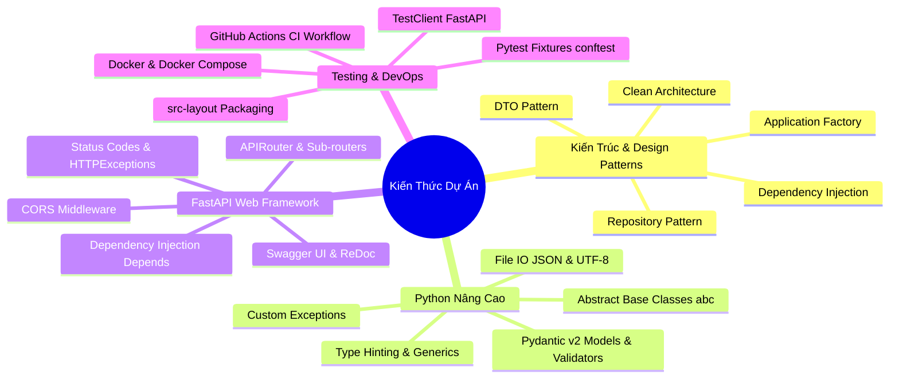
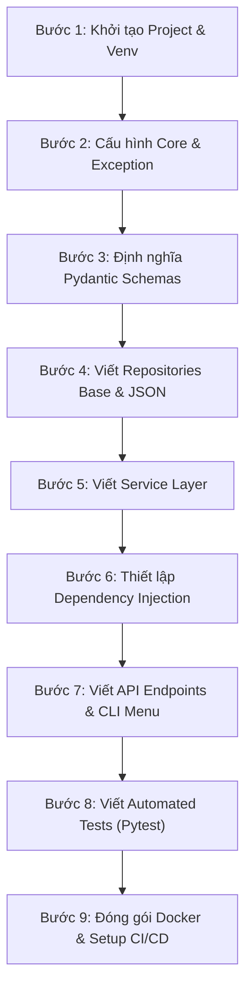

# 📚 CẨM NANG TOÀN DIỆN: TỔNG HỢP KIẾN THỨC & CÁCH XÂY DỰNG DỰ ÁN
**Dự Án:** Booking & Scheduling Management System  
**Kiến Trúc:** Clean Architecture + src-layout + REST API (FastAPI) & CLI Console

---

## 📑 MỤC LỤC
1. [Giới Thiệu Tổng Quan](#1-giới-thiệu-tổng-quan)
2. [Tổng Hợp Toàn Bộ Khối Kiến Thức Cốt Lõi](#2-tổng-hợp-toàn-bộ-khối-kiến-thức-cốt-lõi)
   - [2.1. Tư Duy Kiến Trúc Phần Mềm (Software Architecture)](#21-tư-duy-kiến-trúc-phần-mềm-software-architecture)
   - [2.2. Lập Trình Hướng Đối Tượng & Design Patterns (OOP & Patterns)](#22-lập-trình-hướng-đối-tượng--design-patterns-oop--patterns)
   - [2.3. Pydantic v2 & Chuẩn Hóa Dữ Liệu (DTO / Data Validation)](#23-pydantic-v2--chuẩn-hóa-dữ-liệu-dto--data-validation)
   - [2.4. Xây Dựng RESTful API với FastAPI](#24-xây-dựng-restful-api-với-fastapi)
   - [2.5. Xây Dựng CLI Console App Độc Lập](#25-xây-dựng-cli-console-app-độc-lập)
   - [2.6. Quản Lý File & Xử Lý Ngoại Lệ (File I/O & Exception Handling)](#26-quản-lý-file--xử-lý-ngoại-lệ-file-io--exception-handling)
   - [2.7. Tổ Chức Cấu Trúc Dự Án Chuẩn Công Nghiệp (`src-layout`)](#27-tổ-chức-cấu-trúc-dự-án-chuẩn-công-nghiệp-src-layout)
   - [2.8. Kiểm Thử Tự Động (Automated Testing với Pytest)](#28-kiểm-thử-tự-động-automated-testing-với-pytest)
   - [2.9. Đóng Gói Docker & Tự Động Hóa CI/CD](#29-đóng-gói-docker--tự-động-hóa-cicd)
3. [Hướng Dẫn Từng Bước Xây Dựng Dự Án Từ Con Số 0](#3-hướng-dẫn-từng-bước-xây-dựng-dự-án-từ-con-số-0)
   - [Bước 1: Khởi Tạo Môi Trường & Cấu Trúc Thư Mục](#bước-1-khởi-tạo-môi-trường--cấu-trúc-thư-mục)
   - [Bước 2: Xây Dựng Core Config & Custom Exceptions](#bước-2-xây-dựng-core-config--custom-exceptions)
   - [Bước 3: Định Nghĩa DTO / Schemas với Pydantic](#bước-3-định-nghĩa-dto--schemas-với-pydantic)
   - [Bước 4: Xây Dựng Tầng Data Access (Repository Pattern)](#bước-4-xây-dựng-tầng-data-access-repository-pattern)
   - [Bước 5: Xây Dựng Tầng Nghiệp Vụ Cốt Lõi (Service Layer)](#bước-5-xây-dựng-tầng-nghiệp-vụ-cốt-lõi-service-layer)
   - [Bước 6: Thiết Lập Dependency Injection (deps.py)](#bước-6-thiết-lập-dependency-injection-depspy)
   - [Bước 7: Xây Dựng Giao Diện CLI & REST API](#bước-7-xây-dựng-giao-diện-cli--rest-api)
   - [Bước 8: Viết Unit Test & Integration Test Toàn Diện](#bước-8-viết-unit-test--integration-test-toàn-diện)
   - [Bước 9: Đóng Gói Docker & Thiết Lập GitHub Actions](#bước-9-đóng-gói-docker--thiết-lập-github-actions)
4. [Kinh Nghiệm & Best Practices Đúc Kết](#4-kinh-nghiệm--best-practices-đúc-kết)

---

## 1. Giới Thiệu Tổng Quan

Dự án **Booking & Scheduling Management System** là một ví dụ điển hình về phần mềm quản lý đặt lịch hẹn thực tế, giải quyết bài toán:
* Cung cấp **2 giao diện song song**: Giao diện dòng lệnh **CLI Console** và Giao diện lập trình ứng dụng **REST API (FastAPI)**.
* Đảm bảo **tái sử dụng 100% logic nghiệp vụ** giữa API và CLI.
* Độc lập hoàn toàn với tầng lưu trữ (dễ dàng chuyển từ file JSON sang PostgreSQL / MySQL mà không phải sửa logic nghiệp vụ).
* Có quy trình kiểm thử tự động (Pytest) và quy trình tích hợp liên tục (CI/CD GitHub Actions).

---

## 2. Tổng Hợp Toàn Bộ Khối Kiến Thức Cốt Lõi



---

### 2.1. Tư Duy Kiến Trúc Phần Mềm (Software Architecture)

#### A. Clean Architecture (Kiến trúc phân tầng sạch)
Mục tiêu cốt lõi của Clean Architecture là **"Tách biệt mối bận tâm" (Separation of Concerns)** và **"Quy tắc phụ thuộc" (Dependency Rule)**:
1. **Presentation Layer (Tầng hiển thị/giao tiếp):** FastAPI Router, CLI Console. Chỉ lo nhận input, kiểm tra format cơ bản và trả về format phù hợp (JSON hoặc bảng Console). Không chứa logic nghiệp vụ đặt lịch.
2. **Business Logic Layer (Tầng nghiệp vụ - Service):** `BookingService`. Chứa quy tắc như: Tên không được rỗng, lịch đã hủy thì xử lý ra sao, kiểm tra ID hợp lệ. Hoàn toàn không biết dữ liệu được lưu vào đâu (file hay database).
3. **Data Access Layer (Tầng truy xuất dữ liệu - Repository):** `JSONBookingRepository`. Chỉ lo việc đọc file, tìm kiếm phần tử, ghi file.
4. **Domain & Schemas:** `BookingCreate`, `BookingResponse`, `BookingUpdate`. Là "ngôn ngữ chung" luân chuyển giữa tất cả các tầng.

---

### 2.2. Lập Trình Hướng Đối Tượng & Design Patterns (OOP & Patterns)

#### A. Repository Pattern kết hợp Abstract Base Class (`abc.ABC`)
Trừu tượng hóa kho dữ liệu giúp mã nguồn không bị gắn chặt vào một hệ quản trị cụ thể:

```python
from abc import ABC, abstractmethod
from typing import List, Optional
from booking_app.schemas.booking import BookingCreate, BookingResponse, BookingUpdate

class BaseBookingRepository(ABC):
    """Giao diện trừu tượng - Quy định HỢP ĐỒNG mà mọi Repository phải tuân thủ."""

    @abstractmethod
    def get_all(self) -> List[BookingResponse]: ...

    @abstractmethod
    def get_by_id(self, booking_id: int) -> Optional[BookingResponse]: ...

    @abstractmethod
    def create(self, booking: BookingCreate) -> BookingResponse: ...

    @abstractmethod
    def update(self, booking_id: int, booking_update: BookingUpdate) -> Optional[BookingResponse]: ...

    @abstractmethod
    def delete(self, booking_id: int) -> bool: ...
```

#### B. Dependency Injection (DI) & Inversion of Control (IoC)
Thay vì `BookingService` tự tạo ra `JSONBookingRepository` bên trong nó (gây phụ thuộc cứng):
```python
# ❌ Cách làm cũ (Tight Coupling - Phụ thuộc cứng):
class BookingService:
    def __init__(self):
        self.repository = JSONBookingRepository("data/bookings.json") # Không thể mock khi test!

# ✅ Cách làm chuẩn Clean Architecture (Dependency Injection):
class BookingService:
    def __init__(self, repository: BaseBookingRepository):
        self.repository = repository # Nhận bất kỳ Repository nào cài đặt BaseBookingRepository
```

Ở file [deps.py](file:///e:/Booking-SchedulingManagement/src/booking_app/api/deps.py), ta có **Composition Root**:
```python
from functools import lru_cache
from booking_app.repositories.json_repository import JSONBookingRepository
from booking_app.services.booking_service import BookingService

@lru_cache()
def get_repository() -> JSONBookingRepository:
    return JSONBookingRepository()

def get_booking_service() -> BookingService:
    return BookingService(repository=get_repository())
```

#### C. Application Factory Pattern
Thay vì tạo biến toàn cục `app = FastAPI()`, ta đóng gói trong hàm `create_app()`:
* Dễ dàng tạo instance app mới khi chạy Integration Test với cấu hình mock độc lập.
* Quản lý vòng đời khởi tạo middleware, routes rõ ràng.

---

### 2.3. Pydantic v2 & Chuẩn Hóa Dữ Liệu (DTO / Data Validation)

Dự án áp dụng **DTO Pattern (Data Transfer Object)** tách biệt các mục đích:
1. **`BookingCreate`**: Dữ liệu người dùng gửi lên khi tạo mới (chỉ gồm `customer`, `service`, `time`, `notes`).
2. **`BookingUpdate`**: Dữ liệu khi cập nhật (cho phép tùy chọn các trường `Optional`).
3. **`BookingResponse`**: Dữ liệu hệ thống trả về client (được bổ sung thêm `id`, `status`, `created_at`).

```python
from enum import Enum
from typing import Optional
from pydantic import BaseModel, Field

class BookingStatus(str, Enum):
    CONFIRMED = "CONFIRMED"
    CANCELLED = "CANCELLED"
    COMPLETED = "COMPLETED"

class BookingCreate(BaseModel):
    customer: str = Field(..., min_length=2, description="Tên khách hàng")
    service: str = Field(..., min_length=2, description="Tên dịch vụ")
    time: str = Field(..., description="Thời gian hẹn (YYYY-MM-DD HH:MM)")
    notes: Optional[str] = Field(None, description="Ghi chú thêm")

class BookingResponse(BaseModel):
    id: int
    customer: str
    service: str
    time: str
    status: BookingStatus
    notes: Optional[str] = None
    created_at: str
```

---

### 2.4. Xây Dựng RESTful API với FastAPI

Dự án triển khai đầy đủ các tiêu chuẩn REST:
* **GET `/api/v1/bookings`**: Lấy danh sách lịch hẹn (HTTP 200).
* **GET `/api/v1/bookings/{id}`**: Lấy chi tiết lịch hẹn theo ID (HTTP 200 hoặc 404).
* **POST `/api/v1/bookings`**: Tạo mới lịch hẹn (HTTP 201 Created).
* **PUT `/api/v1/bookings/{id}/cancel`**: Hủy lịch hẹn (HTTP 200).
* **DELETE `/api/v1/bookings/{id}`**: Xóa vĩnh viễn lịch hẹn (HTTP 200).

```python
@router.post("", response_model=BookingResponse, status_code=status.HTTP_201_CREATED)
def create_booking(
    booking_in: BookingCreate,
    service: BookingService = Depends(get_booking_service),
):
    try:
        return service.create_booking(booking_in)
    except BookingValidationException as e:
        raise HTTPException(status_code=status.HTTP_400_BAD_REQUEST, detail=str(e))
```

---

### 2.5. Xây Dựng CLI Console App Độc Lập

File [cli.py](file:///e:/Booking-SchedulingManagement/src/booking_app/cli.py) sử dụng trực tiếp `BookingService`:
* Tái sử dụng trọn vẹn logic kiểm tra hợp lệ mà không cần gọi qua mạng HTTP.
* Bắt lỗi `ValidationError` của Pydantic để in thông báo tiếng Việt thân thiện trên terminal.
* Hỗ trợ chuẩn Unicode UTF-8 trên Windows PowerShell / CMD:
```python
if hasattr(sys.stdout, "reconfigure"):
    sys.stdout.reconfigure(encoding="utf-8", errors="replace")
```

---

### 2.6. Quản Lý File & Xử Lý Ngoại Lệ (File I/O & Exception Handling)

#### A. Custom Exceptions
Tạo phân cấp lỗi riêng cho hệ thống giúp phân biệt lỗi nghiệp vụ với lỗi hệ thống:
```python
class BookingAppException(Exception):
    """Lớp cha cho toàn bộ lỗi trong hệ thống."""
    pass

class BookingNotFoundException(BookingAppException):
    def __init__(self, booking_id: int):
        super().__init__(f"Không tìm thấy lịch hẹn mã #{booking_id}!")

class BookingValidationException(BookingAppException):
    pass
```

#### B. Thao tác File JSON An Toàn & Bền Vững
* Tự động tạo thư mục cha nếu chưa có (`os.makedirs(dir_name, exist_ok=True)`).
* Mã hóa `encoding="utf-8"` và `ensure_ascii=False` để tiếng Việt hiển thị chính xác.
* `indent=2` để file JSON dễ đọc và chỉnh sửa bằng tay khi cần.

---

### 2.7. Tổ Chức Cấu Trúc Dự Án Chuẩn Công Nghiệp (`src-layout`)

```text
Booking-SchedulingManagement/
├── src/
│   └── booking_app/              # Package chính (Bắt buộc dùng src/ để tránh Import Side-effects)
│       ├── api/                  # Tầng Web / Controller
│       ├── core/                 # Cấu hình Settings, Biến môi trường, Exceptions
│       ├── repositories/         # Tầng lưu trữ dữ liệu (Repository Pattern)
│       ├── schemas/              # Pydantic Schemas / DTOs
│       ├── services/             # Business Logic Layer
│       ├── main.py               # Entrypoint FastAPI
│       └── cli.py                # Entrypoint CLI
├── tests/
│   ├── conftest.py               # Fixtures dùng chung cho Pytest
│   ├── unit/                     # Unit Tests
│   └── integration/              # Integration Tests
├── requirements/
│   ├── base.txt                  # Thư viện cho môi trường Production
│   └── dev.txt                   # Thư viện cho môi trường Development (pytest, httpx)
├── pyproject.toml                # Metadata dự án và cấu hình pytest/linters
├── Dockerfile & docker-compose.yml
├── run_api.py & run_cli.py       # Shortcut scripts ở root
```

---

### 2.8. Kiểm Thử Tự Động (Automated Testing với Pytest)

Kiểm thử được chia làm 2 cấp độ:

#### A. Unit Test (`tests/unit/test_service.py`)
Kiểm tra từng hàm nghiệp vụ của `BookingService` độc lập. Dùng `temp_json_file` fixture để mỗi test case chạy trên 1 file tạm riêng biệt, không đè lên dữ liệu thật.

#### B. Integration Test (`tests/integration/test_api.py`)
Sử dụng `TestClient` của FastAPI để giả lập gửi request HTTP thật vào endpoint và kiểm tra Status Code cùng JSON Response trả về:

```python
def test_create_booking_api(client):
    payload = {
        "customer": "Trần Thị B",
        "service": "Tư vấn thiết kế",
        "time": "2026-09-20 14:00",
        "notes": "Hẹn qua Zoom"
    }
    response = client.post("/api/v1/bookings", json=payload)
    assert response.status_code == 201
    data = response.json()
    assert data["customer"] == "Trần Thị B"
    assert data["status"] == "CONFIRMED"
```

---

### 2.9. Đóng Gói Docker & Tự Động Hóa CI/CD

#### A. Dockerfile Tối Ưu
* Sử dụng base image `python:3.11-slim` để dung lượng nhẹ nhất.
* Cài đặt `requirements/base.txt`.
* Thiết lập `PYTHONPATH=/app/src` để Python nhận diện package `booking_app`.

#### B. GitHub Actions CI (`.github/workflows/tests.yml`)
* Tự động kích hoạt khi có `push` hoặc `pull_request`.
* Chạy ma trận đa phiên bản Python (`3.10`, `3.11`, `3.12`) trên Ubuntu runner để đảm bảo tương thích đa môi trường.

---

## 3. Hướng Dẫn Từng Bước Xây Dựng Dự Án Từ Con Số 0

Dưới đây là quy trình 9 bước chuẩn chỉ để bạn tự tay xây dựng một dự án tương tự từ đầu:



---

### Bước 1: Khởi Tạo Môi Trường & Cấu Trúc Thư Mục

1. Mở Terminal và tạo cấu trúc thư mục:
```bash
mkdir my_booking_app && cd my_booking_app
mkdir -p src/booking_app/{api/v1/endpoints,core,models,repositories,schemas,services}
mkdir -p tests/{unit,integration}
mkdir -p data requirements .github/workflows
```

2. Tạo môi trường ảo và cài đặt thư viện:
```bash
python -m venv venv
.\venv\Scripts\activate      # Trên Windows
# source venv/bin/activate    # Trên Linux/macOS
```

3. Tạo file `requirements/base.txt`:
```text
fastapi>=0.110.0
uvicorn[standard]>=0.28.0
pydantic>=2.6.0
python-dotenv>=1.0.0
```

4. Tạo file `requirements/dev.txt`:
```text
-r base.txt
pytest>=8.0.0
httpx>=0.27.0
```

5. Cài đặt thư viện:
```bash
pip install -r requirements/dev.txt
```

6. Tạo file `pyproject.toml` ở thư mục gốc:
```toml
[build-system]
requires = ["setuptools>=61.0"]
build-backend = "setuptools.build_meta"

[project]
name = "booking_app"
version = "1.0.0"
requires-python = ">=3.10"

[tool.pytest.ini_options]
pythonpath = ["src"]
testpaths = ["tests"]
```

---

### Bước 2: Xây Dựng Core Config & Custom Exceptions

1. Tạo file `src/booking_app/core/config.py`:
```python
import os
from pydantic import BaseModel

class Settings(BaseModel):
    PROJECT_NAME: str = "Booking & Scheduling Management API"
    VERSION: str = "1.0.0"
    API_V1_STR: str = "/api/v1"
    HOST: str = os.getenv("HOST", "127.0.0.1")
    PORT: int = int(os.getenv("PORT", "8000"))
    DATA_FILE_PATH: str = os.getenv("DATA_FILE_PATH", "data/bookings.json")

settings = Settings()
```

2. Tạo file `src/booking_app/core/exceptions.py`:
```python
class BookingAppException(Exception):
    pass

class BookingNotFoundException(BookingAppException):
    def __init__(self, booking_id: int):
        super().__init__(f"Không tìm thấy lịch hẹn mã #{booking_id}!")

class BookingValidationException(BookingAppException):
    pass
```

---

### Bước 3: Định Nghĩa DTO / Schemas với Pydantic

Tạo file `src/booking_app/schemas/booking.py`:
```python
from enum import Enum
from typing import Optional
from pydantic import BaseModel, Field

class BookingStatus(str, Enum):
    CONFIRMED = "CONFIRMED"
    CANCELLED = "CANCELLED"
    COMPLETED = "COMPLETED"

class BookingBase(BaseModel):
    customer: str = Field(..., min_length=1, description="Tên khách hàng")
    service: str = Field(..., min_length=1, description="Tên dịch vụ")
    time: str = Field(..., description="Thời gian hẹn (YYYY-MM-DD HH:MM)")
    notes: Optional[str] = Field(None, description="Ghi chú thêm")

class BookingCreate(BookingBase):
    pass

class BookingUpdate(BaseModel):
    customer: Optional[str] = None
    service: Optional[str] = None
    time: Optional[str] = None
    notes: Optional[str] = None
    status: Optional[BookingStatus] = None

class BookingResponse(BookingBase):
    id: int
    status: BookingStatus
    created_at: str
```

---

### Bước 4: Xây Dựng Tầng Data Access (Repository Pattern)

1. Tạo file Interface `src/booking_app/repositories/base.py`:
```python
from abc import ABC, abstractmethod
from typing import List, Optional
from booking_app.schemas.booking import BookingResponse, BookingCreate, BookingUpdate

class BaseBookingRepository(ABC):
    @abstractmethod
    def get_all(self) -> List[BookingResponse]: pass

    @abstractmethod
    def get_by_id(self, booking_id: int) -> Optional[BookingResponse]: pass

    @abstractmethod
    def create(self, booking: BookingCreate) -> BookingResponse: pass

    @abstractmethod
    def update(self, booking_id: int, booking_update: BookingUpdate) -> Optional[BookingResponse]: pass

    @abstractmethod
    def delete(self, booking_id: int) -> bool: pass
```

2. Tạo file Triển khai JSON `src/booking_app/repositories/json_repository.py`:
```python
import json
import os
from datetime import datetime
from typing import List, Optional
from booking_app.repositories.base import BaseBookingRepository
from booking_app.schemas.booking import BookingResponse, BookingCreate, BookingUpdate, BookingStatus

class JSONBookingRepository(BaseBookingRepository):
    def __init__(self, file_path: str = "data/bookings.json"):
        self.file_path = file_path
        self._ensure_file_exists()

    def _ensure_file_exists(self):
        dir_name = os.path.dirname(self.file_path)
        if dir_name:
            os.makedirs(dir_name, exist_ok=True)
        if not os.path.exists(self.file_path):
            with open(self.file_path, "w", encoding="utf-8") as f:
                json.dump([], f, ensure_ascii=False, indent=2)

    def _read_data(self) -> List[dict]:
        try:
            with open(self.file_path, "r", encoding="utf-8") as f:
                return json.load(f)
        except (json.JSONDecodeError, FileNotFoundError):
            return []

    def _write_data(self, data: List[dict]) -> None:
        with open(self.file_path, "w", encoding="utf-8") as f:
            json.dump(data, f, ensure_ascii=False, indent=2)

    def get_all(self) -> List[BookingResponse]:
        return [BookingResponse(**item) for item in self._read_data()]

    def get_by_id(self, booking_id: int) -> Optional[BookingResponse]:
        for item in self._read_data():
            if item["id"] == booking_id:
                return BookingResponse(**item)
        return None

    def create(self, booking_in: BookingCreate) -> BookingResponse:
        raw_list = self._read_data()
        new_id = (raw_list[-1]["id"] + 1) if raw_list else 1
        new_item = {
            "id": new_id,
            "customer": booking_in.customer,
            "service": booking_in.service,
            "time": booking_in.time,
            "notes": booking_in.notes,
            "status": BookingStatus.CONFIRMED.value,
            "created_at": datetime.now().strftime("%Y-%m-%d %H:%M:%S"),
        }
        raw_list.append(new_item)
        self._write_data(raw_list)
        return BookingResponse(**new_item)

    def update(self, booking_id: int, booking_update: BookingUpdate) -> Optional[BookingResponse]:
        raw_list = self._read_data()
        for index, item in enumerate(raw_list):
            if item["id"] == booking_id:
                update_data = booking_update.model_dump(exclude_unset=True)
                for key, val in update_data.items():
                    if val is not None:
                        item[key] = val.value if hasattr(val, "value") else val
                raw_list[index] = item
                self._write_data(raw_list)
                return BookingResponse(**item)
        return None

    def delete(self, booking_id: int) -> bool:
        raw_list = self._read_data()
        for index, item in enumerate(raw_list):
            if item["id"] == booking_id:
                raw_list.pop(index)
                self._write_data(raw_list)
                return True
        return False
```

---

### Bước 5: Xây Dựng Tầng Nghiệp Vụ Cốt Lõi (Service Layer)

Tạo file `src/booking_app/services/booking_service.py`:
```python
from typing import List
from booking_app.repositories.base import BaseBookingRepository
from booking_app.schemas.booking import BookingCreate, BookingResponse, BookingUpdate, BookingStatus
from booking_app.core.exceptions import BookingNotFoundException, BookingValidationException

class BookingService:
    def __init__(self, repository: BaseBookingRepository):
        self.repository = repository

    def list_all_bookings(self) -> List[BookingResponse]:
        return self.repository.get_all()

    def get_booking(self, booking_id: int) -> BookingResponse:
        booking = self.repository.get_by_id(booking_id)
        if not booking:
            raise BookingNotFoundException(booking_id)
        return booking

    def create_booking(self, booking_in: BookingCreate) -> BookingResponse:
        if not booking_in.customer.strip():
            raise BookingValidationException("Tên khách hàng không được để trống!")
        if not booking_in.service.strip():
            raise BookingValidationException("Tên dịch vụ không được để trống!")
        return self.repository.create(booking_in)

    def cancel_booking(self, booking_id: int) -> BookingResponse:
        booking = self.get_booking(booking_id)
        if booking.status == BookingStatus.CANCELLED:
            return booking

        update_dto = BookingUpdate(status=BookingStatus.CANCELLED)
        updated = self.repository.update(booking_id, update_dto)
        if not updated:
            raise BookingNotFoundException(booking_id)
        return updated

    def delete_booking(self, booking_id: int) -> bool:
        self.get_booking(booking_id)
        return self.repository.delete(booking_id)
```

---

### Bước 6: Thiết Lập Dependency Injection (`deps.py`)

Tạo file `src/booking_app/api/deps.py`:
```python
from functools import lru_cache
from booking_app.core.config import settings
from booking_app.repositories.json_repository import JSONBookingRepository
from booking_app.services.booking_service import BookingService

@lru_cache()
def get_repository() -> JSONBookingRepository:
    return JSONBookingRepository(file_path=settings.DATA_FILE_PATH)

def get_booking_service() -> BookingService:
    repo = get_repository()
    return BookingService(repository=repo)
```

---

### Bước 7: Xây Dựng Giao Diện CLI & REST API

1. Viết Endpoints `src/booking_app/api/v1/endpoints/bookings.py`:
```python
from typing import List
from fastapi import APIRouter, Depends, HTTPException, status
from booking_app.api.deps import get_booking_service
from booking_app.core.exceptions import BookingNotFoundException, BookingValidationException
from booking_app.schemas.booking import BookingCreate, BookingResponse
from booking_app.services.booking_service import BookingService

router = APIRouter()

@router.get("", response_model=List[BookingResponse], summary="Lấy danh sách tất cả lịch hẹn")
def read_bookings(service: BookingService = Depends(get_booking_service)):
    return service.list_all_bookings()

@router.get("/{booking_id}", response_model=BookingResponse, summary="Chi tiết một lịch hẹn")
def read_booking(booking_id: int, service: BookingService = Depends(get_booking_service)):
    try:
        return service.get_booking(booking_id)
    except BookingNotFoundException as e:
        raise HTTPException(status_code=status.HTTP_404_NOT_FOUND, detail=str(e))

@router.post("", response_model=BookingResponse, status_code=status.HTTP_201_CREATED, summary="Tạo lịch hẹn mới")
def create_booking(booking_in: BookingCreate, service: BookingService = Depends(get_booking_service)):
    try:
        return service.create_booking(booking_in)
    except BookingValidationException as e:
        raise HTTPException(status_code=status.HTTP_400_BAD_REQUEST, detail=str(e))

@router.put("/{booking_id}/cancel", response_model=BookingResponse, summary="Hủy lịch hẹn")
def cancel_booking(booking_id: int, service: BookingService = Depends(get_booking_service)):
    try:
        return service.cancel_booking(booking_id)
    except BookingNotFoundException as e:
        raise HTTPException(status_code=status.HTTP_404_NOT_FOUND, detail=str(e))

@router.delete("/{booking_id}", status_code=status.HTTP_200_OK, summary="Xóa vĩnh viễn lịch hẹn")
def delete_booking(booking_id: int, service: BookingService = Depends(get_booking_service)):
    try:
        service.delete_booking(booking_id)
        return {"message": f"Đã xóa thành công lịch hẹn ID: {booking_id}"}
    except BookingNotFoundException as e:
        raise HTTPException(status_code=status.HTTP_404_NOT_FOUND, detail=str(e))
```

2. Tạo Router tổng `src/booking_app/api/v1/router.py`:
```python
from fastapi import APIRouter
from booking_app.api.v1.endpoints import bookings

api_router = APIRouter()
api_router.include_router(bookings.router, prefix="/bookings", tags=["Đặt lịch hẹn"])
```

3. Tạo file khởi tạo App `src/booking_app/main.py`:
```python
import uvicorn
from fastapi import FastAPI
from fastapi.middleware.cors import CORSMiddleware
from booking_app.core.config import settings
from booking_app.api.v1.router import api_router

def create_app() -> FastAPI:
    app = FastAPI(title=settings.PROJECT_NAME, version=settings.VERSION, docs_url="/docs", redoc_url="/redoc")
    app.add_middleware(CORSMiddleware, allow_origins=["*"], allow_credentials=True, allow_methods=["*"], allow_headers=["*"])
    application = app
    application.include_router(api_router, prefix=settings.API_V1_STR)
    
    @application.get("/", tags=["Hệ thống"])
    def root():
        return {"name": settings.PROJECT_NAME, "version": settings.VERSION, "docs": "/docs", "status": "running"}
        
    return application

app = create_app()
```

4. Tạo Script chạy nhanh ở root `run_api.py` và `run_cli.py`:
   - `run_api.py`: Chạy Uvicorn server `uvicorn.run("booking_app.main:app", host="127.0.0.1", port=8000, reload=True)`.
   - `run_cli.py`: Gọi `booking_app.cli.main()`.

---

### Bước 8: Viết Unit Test & Integration Test Toàn Diện

1. Tạo `tests/conftest.py`:
```python
import os, tempfile, pytest
from fastapi.testclient import TestClient
from booking_app.repositories.json_repository import JSONBookingRepository
from booking_app.services.booking_service import BookingService
from booking_app.main import create_app
from booking_app.api.deps import get_booking_service

@pytest.fixture
def temp_json_file():
    fd, path = tempfile.mkstemp(suffix=".json")
    os.close(fd)
    yield path
    if os.path.exists(path):
        os.remove(path)

@pytest.fixture
def test_repo(temp_json_file):
    return JSONBookingRepository(file_path=temp_json_file)

@pytest.fixture
def test_service(test_repo):
    return BookingService(repository=test_repo)

@pytest.fixture
def client(test_service):
    app = create_app()
    app.dependency_overrides[get_booking_service] = lambda: test_service
    with TestClient(app) as test_client:
        yield test_client
```

2. Viết Unit Test `tests/unit/test_booking_service.py`:
```python
import pytest
from booking_app.schemas.booking import BookingCreate, BookingStatus
from booking_app.core.exceptions import BookingNotFoundException, BookingValidationException

def test_create_booking_success(test_service):
    dto = BookingCreate(customer="Nguyễn Văn A", service="Khám răng", time="2026-09-10 09:00")
    booking = test_service.create_booking(dto)
    assert booking.id == 1
    assert booking.customer == "Nguyễn Văn A"
    assert booking.status == BookingStatus.CONFIRMED

def test_cancel_booking(test_service):
    dto = BookingCreate(customer="Trần B", service="Tư vấn", time="2026-09-11 10:00")
    created = test_service.create_booking(dto)
    cancelled = test_service.cancel_booking(created.id)
    assert cancelled.status == BookingStatus.CANCELLED
```

3. Chạy kiểm thử:
```bash
pytest
```

---

### Bước 9: Đóng Gói Docker & Thiết Lập GitHub Actions

1. Tạo `Dockerfile`:
```dockerfile
FROM python:3.11-slim

WORKDIR /app
COPY requirements/base.txt ./requirements.txt
RUN pip install --no-cache-dir -r requirements.txt

COPY src/ ./src/
ENV PYTHONPATH=/app/src
EXPOSE 8000

CMD ["python", "-m", "uvicorn", "booking_app.main:app", "--host", "0.0.0.0", "--port", "8000"]
```

2. Tạo `docker-compose.yml`:
```yaml
version: '3.8'
services:
  api:
    build: .
    ports:
      - "8000:8000"
    volumes:
      - ./data:/app/data
    environment:
      - DATA_FILE_PATH=data/bookings.json
```

3. Tạo `.github/workflows/tests.yml`:
```yaml
name: Continuous Integration (CI)

on: [push, pull_request]

jobs:
  test:
    runs-on: ubuntu-latest
    strategy:
      matrix:
        python-version: ["3.10", "3.11", "3.12"]
    steps:
      - uses: actions/checkout@v4
      - name: Set up Python ${{ matrix.python-version }}
        uses: actions/setup-python@v5
        with:
          python-version: ${{ matrix.python-version }}
      - name: Install Dependencies
        run: |
          python -m pip install --upgrade pip
          pip install -r requirements/dev.txt
      - name: Run Pytest
        run: pytest
```

---

## 4. Kinh Nghiệm & Best Practices Đúc Kết

| Tiêu Chí | Thực Hành Kém (Bad Practice) ❌ | Thực Hành Chuẩn (Best Practice) ✅ |
| :--- | :--- | :--- |
| **Cấu trúc thư mục** | Để toàn bộ code ở root (`flat layout`), dễ bị conflict import. | Dùng `src-layout` (`src/booking_app/`) giúp code cô lập và đóng gói chuẩn. |
| **Truy xuất dữ liệu** | Viết code đọc/ghi file trực tiếp bên trong route của FastAPI. | Tách riêng qua `Repository Pattern`, giao tiếp qua `Interface` trừu tượng. |
| **Xác thực dữ liệu** | Tự viết `if-else` thủ công kiểm tra kiểu dữ liệu của từng dictionary. | Dùng **Pydantic v2** với Schema/DTOs rõ ràng (`BookingCreate`, `BookingResponse`). |
| **Logic nghiệp vụ** | Viết logic tính toán trong controller HTTP. | Đóng gói 100% logic vào `BookingService` để CLI và API dùng chung. |
| **Kiểm thử (Testing)** | Chạy test trực tiếp trên file database/json thật làm sai lệch dữ liệu. | Dùng Pytest Fixtures (`tempfile`) tạo file tạm và mock dependencies. |
| **Quản trị thư viện** | Gom chung 1 file `requirements.txt` chứa cả dev và prod. | Tách nhỏ `requirements/base.txt` (cho prod) và `requirements/dev.txt` (cho test). |
