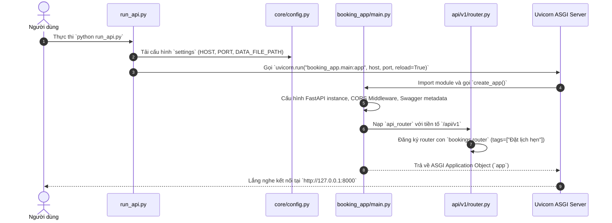
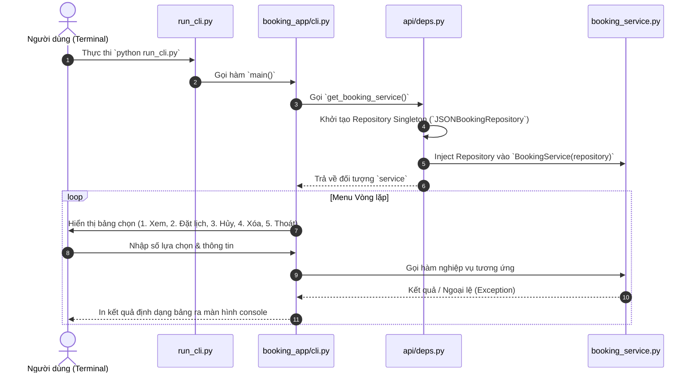
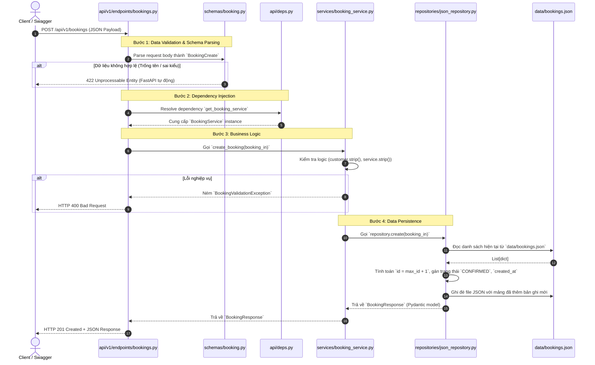
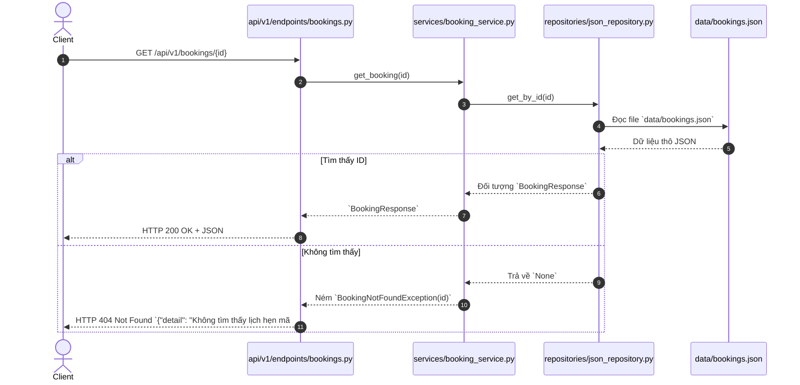
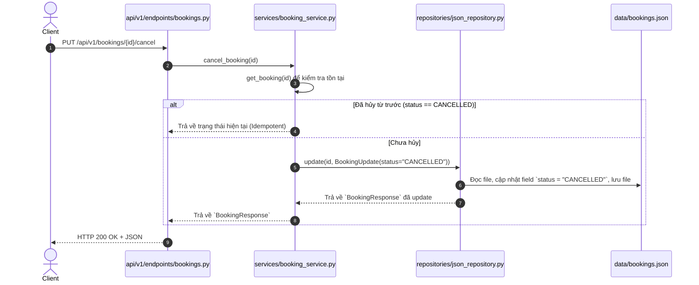
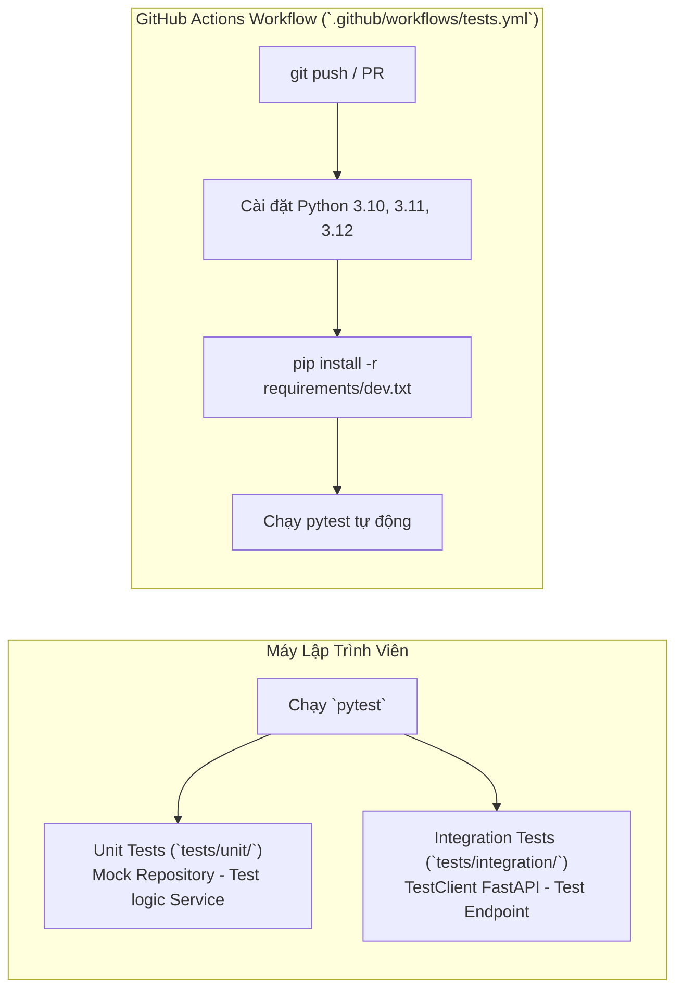

# 🧭 SƠ ĐỒ VÀ LUỒNG CHẠY HỆ THỐNG (EXECUTION FLOW)
**Dự Án: Booking & Scheduling Management System**

---

## 📑 MỤC LỤC
1. [Tổng Quan Kiến Trúc (Clean Architecture)](#1-tổng-quan-kiến-trúc-clean-architecture)
2. [Luồng Khởi Động Hệ Thống (Startup Lifecycle)](#2-luồng-khởi-động-hệ-thống-startup-lifecycle)
   - [2.1. Luồng chạy REST API Server (FastAPI)](#21-luồng-chạy-rest-api-server-fastapi)
   - [2.2. Luồng chạy Giao diện Dòng lệnh (CLI)](#22-luồng-chạy-giao-diện-dòng-lệnh-cli)
3. [Luồng Xử Lý Dữ Liệu & Request-Response (Request Lifecycle)](#3-luồng-xử-lý-dữ-liệu--request-response-request-lifecycle)
   - [3.1. Luồng Tạo mới Lịch hẹn (POST /api/v1/bookings)](#31-luồng-tạo-mới-lịch-hẹn-post-apiv1bookings)
   - [3.2. Luồng Xem danh sách & Chi tiết (GET)](#32-luồng-xem-danh-sách--chi-tiết-get)
   - [3.3. Luồng Hủy lịch hẹn (PUT /api/v1/bookings/{id}/cancel)](#33-luồng-hủy-lịch-hẹn-put-apiv1bookingsidcancel)
4. [Sơ Đồ Phụ Thuộc & Dependency Injection (DI Flow)](#4-sơ-đồ-phụ-thuộc--dependency-injection-di-flow)
5. [Cơ Chế Lưu Trữ Dữ Liệu (Data Persistence Flow)](#5-cơ-chế-lưu-trữ-dữ-liệu-data-persistence-flow)
6. [Luồng Kiểm Thử & Tự Động Hóa (Testing & CI/CD Flow)](#6-luồng-kiểm-thử--tự-động-hóa-testing--cicd-flow)
7. [Bản Đồ Điều Hướng File Trong Luồng Chạy](#7-bản-đồ-điều-hướng-file-trong-luồng-chạy)

---

## 1. Tổng Quan Kiến Trúc (Clean Architecture)

Hệ thống được thiết kế tách lớp độc lập theo nguyên lý **Inversion of Control (IoC)** và **Separation of Concerns**:

```mermaid
graph TD
    Client["🌐 Client (Web Browser / Postman / Swagger / Terminal)"]
    
    subgraph Presentation_Layer["1. Presentation Layer (Tầng Giao Diện / Giao Tiếp)"]
        API["FastAPI Routes (`src/booking_app/api/`)"]
        CLI["CLI Interface (`src/booking_app/cli.py`)"]
    end

    subgraph DI_Layer["Dependency Injection"]
        Deps["`src/booking_app/api/deps.py`"]
    end

    subgraph Business_Layer["2. Business Logic Layer (Tầng Nghiệp Vụ)"]
        Service["`BookingService` (`src/booking_app/services/booking_service.py`)"]
    end

    subgraph Data_Layer["3. Data Access Layer (Tầng Kho Lưu Trữ)"]
        RepoInterface["`BaseBookingRepository` (Interface trừu tượng)"]
        JSONRepo["`JSONBookingRepository` (Triển khai cụ thể)"]
    end

    subgraph Storage_Layer["4. Storage / Persistence"]
        JSONFile["File JSON (`data/bookings.json`)"]
    end

    subgraph Schema_Layer["Cross-Cutting: Schemas & Validation"]
        Schemas["Pydantic Models (`src/booking_app/schemas/booking.py`)"]
    end

    Client -->|HTTP Request| API
    Client -->|Terminal Input| CLI
    API --> Deps
    CLI --> Deps
    Deps -->|Inject Repository| Service
    Service -->|Gọi qua Interface| RepoInterface
    RepoInterface -.->|Triển khai thực tế| JSONRepo
    JSONRepo -->|Đọc / Ghi File| JSONFile
    
    Schemas -.->|Validate & Định kiểu| API
    Schemas -.->|Validate & Định kiểu| CLI
    Schemas -.->|Sử dụng DTOs| Service
    Schemas -.->|Chuyển đổi DTOs| JSONRepo
```

---

## 2. Luồng Khởi Động Hệ Thống (Startup Lifecycle)

### 2.1. Luồng chạy REST API Server (FastAPI)

Khi người dùng chạy lệnh:
```bash
python run_api.py
```



---

### 2.2. Luồng chạy Giao diện Dòng lệnh (CLI)

Khi người dùng chạy lệnh:
```bash
python run_cli.py
```



---

## 3. Luồng Xử Lý Dữ Liệu & Request-Response (Request Lifecycle)

### 3.1. Luồng Tạo mới Lịch hẹn (`POST /api/v1/bookings`)

Đây là ví dụ luồng toàn diện đi qua toàn bộ các tầng:



---

### 3.2. Luồng Xem danh sách & Chi tiết (GET)



---

### 3.3. Luồng Hủy lịch hẹn (`PUT /api/v1/bookings/{id}/cancel`)



---

## 4. Sơ Đồ Phụ Thuộc & Dependency Injection (DI Flow)

File `src/booking_app/api/deps.py` đóng vai trò là **Composition Root** (nơi liên kết các thành phần phụ thuộc với nhau):

```text
┌────────────────────────────────────────────────────────┐
│                   api/deps.py                          │
│                                                        │
│  @lru_cache()                                          │
│  def get_repository() -> JSONBookingRepository:        │
│       return JSONBookingRepository("data/bookings.json")│
│                                                        │
│  def get_booking_service() -> BookingService:          │
│       repo = get_repository()                          │
│       return BookingService(repository=repo)           │
└──────────────────────────┬─────────────────────────────┘
                           │
             ┌─────────────┴─────────────┐
             ▼                           ▼
┌─────────────────────────┐ ┌─────────────────────────┐
│     FastAPI Endpoints   │ │       CLI Console       │
│ Depends(get_booking_srv)│ │ get_booking_service()   │
└─────────────────────────┘ └─────────────────────────┘
```

> **Lợi ích kiến trúc:**
> * Khi cần chuyển từ lưu file JSON sang cơ sở dữ liệu **PostgreSQL / MySQL / MongoDB**, chỉ cần viết `SQLBookingRepository(BaseBookingRepository)` và thay đổi ở `deps.py`.
> * Toàn bộ code ở tầng **API**, **CLI** và **Service** hoàn toàn giữ nguyên 100% không cần sửa đổi!

---

## 5. Cơ Chế Lưu Trữ Dữ Liệu (Data Persistence Flow)

Cơ chế quản lý file `data/bookings.json`:

1. **Khởi tạo tự động**: Khi `JSONBookingRepository` được tạo, hàm `_ensure_file_exists()` tự động tạo thư mục `data/` và file rỗng `[]` nếu chưa tồn tại.
2. **Đọc dữ liệu (`_read_data`)**: Mở file với mã hóa `utf-8`, dùng `json.load()` để chuyển thành danh sách từ điển Python.
3. **Ghi dữ liệu (`_write_data`)**: Dùng `json.dump(..., ensure_ascii=False, indent=2)` để đảm bảo lưu đúng tiếng Việt có dấu và định dạng đẹp mắt.
4. **Tự tăng ID (Auto-increment)**: `new_id = raw_list[-1]["id"] + 1 if raw_list else 1`.

---

## 6. Luồng Kiểm Thử & Tự Động Hóa (Testing & CI/CD Flow)



---

## 7. Bản Đồ Điều Hướng File Trong Luồng Chạy

| File | Vai trò trong luồng | Mô tả nhiệm vụ |
| :--- | :--- | :--- |
| `run_api.py` | **Entrypoint Web** | Khởi chạy Uvicorn Server và FastAPI |
| `run_cli.py` | **Entrypoint CLI** | Khởi chạy giao diện console dòng lệnh |
| `src/booking_app/main.py` | **App Factory** | Khởi tạo app FastAPI, nạp CORS, Swagger docs và router |
| `src/booking_app/core/config.py` | **Config Layer** | Đọc biến môi trường (Host, Port, File path) |
| `src/booking_app/core/exceptions.py` | **Exception Layer**| Định nghĩa các ngoại lệ nghiệp vụ (NotFound, Validation) |
| `src/booking_app/schemas/booking.py`| **DTO / Schemas** | Xác thực dữ liệu đầu vào / đầu ra bằng Pydantic v2 |
| `src/booking_app/api/deps.py` | **Dependency Root** | Khởi tạo và phân phối Service & Repository |
| `src/booking_app/api/v1/endpoints/bookings.py` | **HTTP Controller** | Tiếp nhận HTTP Request, gọi Service, trả về HTTP Response |
| `src/booking_app/services/booking_service.py` | **Business Logic** | Xử lý quy tắc nghiệp vụ đặt lịch, hủy lịch |
| `src/booking_app/repositories/base.py` | **Abstract Interface**| Quy định các hàm chuẩn CRUD của Repository |
| `src/booking_app/repositories/json_repository.py` | **Data Access** | Đọc và ghi dữ liệu trực tiếp vào `data/bookings.json` |
| `data/bookings.json` | **Database File** | Nơi lưu trữ thực tế của các bản ghi lịch hẹn |
