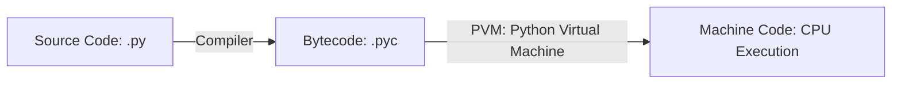
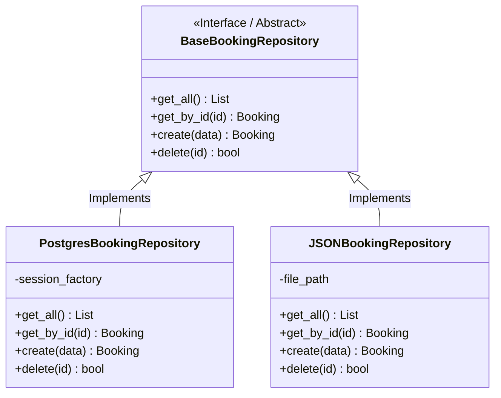

# 🐍 BÁCH KHOA TOÀN THƯ KIẾN THỨC PYTHON TOÀN DIỆN
> **Từ Nền Tảng Cốt Lõi Đến Kiến Trúc Chuyên Nghiệp (Senior Level)**  
> *Tổng hợp đầy đủ cú pháp, cơ chế bên dưới (Internals), OOP, Concurrency, Clean Architecture & Best Practices.*

---

## 📑 MỤC LỤC TỔNG QUAN

1. [CHƯƠNG 1: KIẾN TRÚC & CƠ CHẾ HOẠT ĐỘNG CỦA PYTHON (INTERNALS)](#chương-1-kiến-trúc--cơ-chế-hoạt-động-của-python-internals)
2. [CHƯƠNG 2: HỆ THỐNG KIỂU DỮ LIỆU & TOÁN TỬ CỐT LÕI](#chương-2-hệ-thống-kiểu-dữ-liệu--toán-tử-cốt-lõi)
3. [CHƯƠNG 3: CẤU TRÚC DỮ LIỆU CHUYÊN SÂU (COLLECTIONS & DATA STRUCTURES)](#chương-3-cấu-trúc-dữ-liệu-chuyên-sâu-collections--data-structures)
4. [CHƯƠNG 4: HÀM, PHẠM VI BIẾN & LẬP TRÌNH HÀM (FUNCTIONAL PROGRAMMING)](#chương-4-hàm-phạm-vi-biến--lập-trình-hàm-functional-programming)
5. [CHƯƠNG 5: LẬP TRÌNH HƯỚNG ĐỐI TƯỢNG TOÀN DIỆN (OOP MASTERY)](#chương-5-lập-trình-hướng-đối-tượng-toàn-diện-oop-mastery)
6. [CHƯƠNG 6: SPECIAL METHODS (DUNDER METHODS) & METAPROGRAMMING](#chương-6-special-methods-dunder-methods--metaprogramming)
7. [CHƯƠNG 7: XỬ LÝ NGOẠI LỆ (EXCEPTION HANDLING) & LOGGING](#chương-7-xử-lý-ngoại-lệ-exception-handling--logging)
8. [CHƯƠNG 8: I/O, FILE SYSTEM & CONTEXT MANAGERS](#chương-8-io-file-system--context-managers)
9. [CHƯƠNG 9: ĐA NHIỆM & BẤT ĐỒNG BỘ (ASYNCIO, THREADING, MULTIPROCESSING)](#chương-9-đa-nhiệm--bất-đồng-bộ-asyncio-threading-multiprocessing)
10. [CHƯƠNG 10: TYPE HINTS & DATA VALIDATION (PYDANTIC)](#chương-10-type-hints--data-validation-pydantic)
11. [CHƯƠNG 11: THIẾT KẾ KIẾN TRÚC DỰ ÁN & DESIGN PATTERNS CHUẨN MỰC](#chương-11-thiết-kế-kiến-trúc-dự-án--design-patterns-chuẩn-mực)
12. [CHƯƠNG 12: KIỂM THỬ TỰ ĐỘNG (TESTING VỚI PYTEST) & CODE QUALITY](#chương-12-kiểm-thử-tự-động-testing-với-pytest--code-quality)
13. [CHƯƠNG 13: CÁC CẠM BẪY PHỔ BIẾN (COMMON PITFALLS) & TỐI ƯU HIỆU NĂNG](#chương-13-các-cạm-bẫy-phổ-biến-common-pitfalls--tối-ưu-hiệu-năng)

---

## CHƯƠNG 1: KIẾN TRÚC & CƠ CHẾ HOẠT ĐỘNG CỦA PYTHON (INTERNALS)

### 1.1. Python là ngôn ngữ gì?
Python là ngôn ngữ lập trình **thông dịch (interpreted)**, **định kiểu động (dynamically typed)** và **định kiểu mạnh (strongly typed)**:
- **Định kiểu động**: Không cần khai báo kiểu của biến trước, kiểu được xác định tại thời điểm chạy (runtime).
- **Định kiểu mạnh**: Không tự động ép kiểu ngầm gây mất an toàn (Ví dụ: `"5" + 2` sẽ ném `TypeError`, không tự biến thành `"52"` hay `7`).



### 1.2. Quá trình biên dịch và thực thi
1. **Source Code (`.py`)** được biên dịch thành **Bytecode (`.pyc`)** độc lập nền tảng.
2. **Python Virtual Machine (PVM)** đọc từng lệnh bytecode và chuyển thành mã máy để CPU thực thi.

### 1.3. Quản lý Bộ nhớ (Memory Management) & Garbage Collection (GC)
Python quản lý bộ nhớ tự động thông qua 2 cơ chế chính:
1. **Reference Counting (Đếm tham chiếu)**: Mỗi đối tượng có một bộ đếm `ob_refcnt`. Khi số tham chiếu giảm về `0`, bộ nhớ của đối tượng được giải phóng ngay lập tức.
2. **Generational Garbage Collector**: Xử lý trường hợp **Reference Cycles (Tham chiếu vòng)** mà Reference Counting không tự giải phóng được (Object A trỏ Object B, và Object B trỏ ngược lại Object A). Chia làm 3 thế hệ (Generation 0, 1, 2).

### 1.4. GIL (Global Interpreter Lock)
- **GIL** là một cơ chế khóa trong CPython (bản cài đặt chuẩn của Python) chỉ cho phép **một luồng (thread) thực thi Python bytecode tại một thời điểm**.
- **Hệ quả**:
  - Tác vụ **I/O-bound** (gọi API, đọc file, truy vấn DB): `threading` hoặc `asyncio` hoạt động rất tốt vì Python nhả GIL khi đợi I/O.
  - Tác vụ **CPU-bound** (tính toán ma trận, xử lý ảnh): `threading` không tăng tốc độ do GIL, bắt buộc phải dùng `multiprocessing`.

---

## CHƯƠNG 2: HỆ THỐNG KIỂU DỮ LIỆU & TOÁN TỬ CỐT LÕI

### 2.1. Phân loại Mutability (Khả năng thay đổi giá trị)
| Kiểu Dữ Liệu | Loại | Mutability | Hashable (Làm key Dict/Set)? |
|---|---|---|---|
| `int`, `float`, `complex`, `bool` | Số học | **Immutable** (Bất biến) | Có |
| `str` | Chuỗi ký tự | **Immutable** | Có |
| `tuple` | Bộ giá trị | **Immutable** | Có (nếu mọi phần tử bên trong đều immutable) |
| `frozenset` | Tập hợp đóng băng | **Immutable** | Có |
| `list` | Danh sách | **Mutable** (Khả biến) | Không |
| `dict` | Từ điển | **Mutable** | Không |
| `set` | Tập hợp | **Mutable** | Không |
| `bytearray` | Mảng byte | **Mutable** | Không |

> [!WARNING]
> **Hiện tượng gán tham chiếu (Aliasing):**
> ```python
> a = [1, 2, 3]
> b = a        # b và a trỏ cùng vùng nhớ
> b.append(4)
> print(a)     # Output: [1, 2, 3, 4] -> a bị thay đổi!
> 
> # Cách copy đúng:
> import copy
> shallow_copy = a.copy() # hoặc a[:]
> deep_copy = copy.deepcopy(a) # Cho danh sách lồng nhau
> ```

### 2.2. Chuỗi & String Formatting
```python
name = "Alice"
score = 98.456

# 1. f-string (Khuyên dùng - Nhanh và rõ ràng nhất từ Python 3.6+)
msg = f"Học viên: {name.upper()}, Điểm: {score:.2f}"  # Output: 'Học viên: ALICE, Điểm: 98.46'

# 2. String Slicing: [start:stop:step]
text = "PYTHON"
reversed_text = text[::-1]  # 'NOHTYP'
```

### 2.3. Cú pháp điều khiển mới (Python 3.8+ & 3.10+)
#### Walrus Operator (`:=`) - Gán trong biểu thức (Python 3.8+)
```python
# Tiết kiệm gọi hàm 2 lần
if (n := len(data_list)) > 10:
    print(f"Danh sách quá dài, có {n} phần tử!")
```

#### Structural Pattern Matching (`match-case`) (Python 3.10+)
```python
def handle_command(command: dict):
    match command:
        case {"action": "create", "user": str(username)}:
            print(f"Tạo người dùng: {username}")
        case {"action": "delete", "id": int(uid)}:
            print(f"Xóa ID: {uid}")
        case _:
            print("Lệnh không xác định")
```

---

## CHƯƠNG 3: CẤU TRÚC DỮ LIỆU CHUYÊN SÂU (COLLECTIONS & DATA STRUCTURES)

### 3.1. List, Tuple, Set, Dictionary

#### 1. List (Danh sách mảng động)
- Truy cập theo index: $O(1)$
- `append()`, `pop()` ở cuối: $O(1)$
- `insert()`, `remove()`, `pop(0)` ở đầu: $O(n)$

#### 2. Tuple (Bộ dữ liệu cố định)
- Tốn ít bộ nhớ hơn list, tốc độ duyệt nhanh hơn.
- Tuple unpacking: `x, y, *rest = (1, 2, 3, 4, 5)` -> `x=1`, `y=2`, `rest=[3, 4, 5]`.

#### 3. Set (Tập hợp duy nhất, băm Hash Table)
- Tìm kiếm (`in`), thêm (`add`), xóa (`remove`): trung bình $O(1)$.
- Toán tử tập hợp: `A | B` (Hợp), `A & B` (Giao), `A - B` (Hiệu), `A ^ B` (Hiệu đối xứng).

#### 4. Dictionary (Từ điển Key-Value)
- Từ Python 3.7+, `dict` đảm bảo thứ tự chèn (Insertion order).
- Phương thức an toàn: `d.get("key", default_val)`, `d.setdefault("key", [])`.

### 3.2. Comprehensions (Viết code ngắn gọn, hiệu năng cao)
```python
numbers = [1, 2, 3, 4, 5, 6]

# List comprehension
evens_squared = [x**2 for x in numbers if x % 2 == 0] # [4, 16, 36]

# Dict comprehension
square_map = {x: x**2 for x in numbers} # {1: 1, 2: 4, ...}

# Set comprehension
unique_lengths = {len(w) for w in ["apple", "banana", "kiwi", "pear"]}

# Generator expression (Tiết kiệm bộ nhớ cho tập dữ liệu lớn)
gen = (x**2 for x in range(10_000_000)) # Không tốn RAM lưu mảng!
```

### 3.3. Module `collections` nâng cao
```python
from collections import defaultdict, Counter, deque, namedtuple

# 1. defaultdict: Tự tạo giá trị mặc định khi key chưa tồn tại
group_by_len = defaultdict(list)
group_by_len[5].append("apple")

# 2. Counter: Đếm tần suất xuất hiện cực nhanh
counts = Counter(["apple", "orange", "apple", "banana", "apple"])
print(counts.most_common(1)) # [('apple', 3)]

# 3. deque: Hàng đợi hai đầu (Double-ended Queue), O(1) cho appendleft & popleft
queue = deque([1, 2, 3])
queue.appendleft(0)
queue.pop()

# 4. namedtuple: Tuple có tên trường rõ ràng
Point = namedtuple("Point", ["x", "y"])
p = Point(10, 20)
print(p.x, p.y)
```

---

## CHƯƠNG 4: HÀM, PHẠM VI BIẾN & LẬP TRÌNH HÀM (FUNCTIONAL PROGRAMMING)

### 4.1. Quy tắc LEGB về phạm vi biến (Scope)
Thứ tự tìm kiếm biến của Python:
1. **L**ocal: Trong hàm hiện tại.
2. **E**nclosing: Trong các hàm bao ngoài (closures).
3. **G**lobal: Ở cấp độ module file.
4. **B**uilt-in: Các hàm dựng sẵn (`len`, `range`, `print`).

> Sử dụng từ khóa `global` để sửa biến toàn cục, `nonlocal` để sửa biến trong enclosing scope.

### 4.2. `*args`, `**kwargs`, Positional-Only (`/`) & Keyword-Only (`*`)
```python
def configure_server(host: str, port: int = 8000, /, *flags, timeout: int = 30, **extra_configs):
    """
    - host, port: Bắt buộc truyền theo vị trí (Positional-only vì trước '/')
    - flags: gom các tham số vị trí thừa thành tuple (*args)
    - timeout: Bắt buộc truyền theo tên (Keyword-only vì sau '*')
    - extra_configs: gom các tham số tên thừa thành dict (**kwargs)
    """
    pass

# Gọi hàm:
configure_server("127.0.0.1", 8080, "DEBUG", "LOG", timeout=60, db="postgres")
```

### 4.3. Closures & Decorators (Hàm bao bọc)

#### Decorator là gì?
Decorator là hàm nhận đầu vào là một hàm (hoặc class) và trả về một hàm mới đã được mở rộng hành vi mà không làm thay đổi mã nguồn ban đầu.

```python
import time
from functools import wraps

def timeit_decorator(func):
    """Decorator đo thời gian thực thi của hàm."""
    @wraps(func)  # Giữ lại tên hàm và docstring gốc
    def wrapper(*args, **kwargs):
        start_time = time.perf_counter()
        result = func(*args, **kwargs)
        elapsed = time.perf_counter() - start_time
        print(f"⏱️ Hàm '{func.__name__}' chạy mất: {elapsed:.4f}s")
        return result
    return wrapper

@timeit_decorator
def complex_calculation(n: int):
    return sum(i * i for i in range(n))

complex_calculation(1_000_000)
```

### 4.4. Functional Utilities: `lambda`, `map`, `filter`, `lru_cache`
```python
from functools import lru_cache

# Memoization với @lru_cache giúp tính Fibonacci O(2^n) thành O(n)
@lru_cache(maxsize=128)
def fibonacci(n: int) -> int:
    if n < 2:
        return n
    return fibonacci(n - 1) + fibonacci(n - 2)
```

---

## CHƯƠNG 5: LẬP TRÌNH HƯỚNG ĐỐI TƯỢNG TOÀN DIỆN (OOP MASTERY)

### 5.1. 4 Tính chất cốt lõi của OOP trong Python



#### 1. Đóng gói (Encapsulation)
- Quy ước `_protected_var`: Chỉ dùng trong nội bộ module/class.
- Quy ước `__private_var`: Kích hoạt cơ chế Name Mangling (`_ClassName__private_var`) chống ghi đè vô ý.

#### 2. Kế thừa (Inheritance) & MRO (Method Resolution Order)
- Python hỗ trợ đa kế thừa (Multiple Inheritance).
- Thứ tự tìm kiếm hàm được định đoạt bởi thuật toán **C3 Linearization** (Xem qua `ClassName.__mro__`).
- Gọi phương thức của lớp cha chuẩn xác bằng `super().__init__(...)`.

#### 3. Đa hình (Polymorphism & Duck Typing)
> *"If it walks like a duck and quacks like a duck, it's a duck."*
Không cần ép kiểu nghiêm ngặt, chỉ cần đối tượng có phương thức/thuộc tính tương ứng là có thể sử dụng.

#### 4. Trừu tượng (Abstraction)
Sử dụng module `abc` (Abstract Base Classes) để bắt buộc các lớp con phải triển khai các phương thức cụ thể.

```python
from abc import ABC, abstractmethod

class BaseRepository(ABC):
    @abstractmethod
    def get_by_id(self, item_id: int):
        """Mọi class con bắt buộc phải viết hàm này."""
        pass
```

### 5.2. `@property`, `@classmethod`, `@staticmethod`
```python
class Account:
    interest_rate: float = 0.05  # Class attribute

    def __init__(self, owner: str, balance: float):
        self.owner = owner
        self._balance = balance   # Protected instance attribute

    @property
    def balance(self) -> float:
        """Getter cho balance."""
        return self._balance

    @balance.setter
    def balance(self, value: float):
        """Setter kèm validation."""
        if value < 0:
            raise ValueError("Số dư không thể âm!")
        self._balance = value

    @classmethod
    def set_interest_rate(cls, new_rate: float):
        """Class method nhận 'cls' thay vì 'self'."""
        cls.interest_rate = new_rate

    @staticmethod
    def validate_account_number(acc_no: str) -> bool:
        """Static method độc lập logic."""
        return len(acc_no) == 10 and acc_no.isdigit()
```

### 5.3. Modern Python: `@dataclass`
Thay vì phải viết `__init__`, `__repr__`, `__eq__` thủ công, `@dataclass` tự động sinh mã sạch sẽ:
```python
from dataclasses import dataclass, field
from typing import List

@dataclass(frozen=True)  # frozen=True biến instance thành bất biến và hashable
class UserProfile:
    id: int
    username: str
    tags: List[str] = field(default_factory=list)
```

---

## CHƯƠNG 6: SPECIAL METHODS (DUNDER METHODS) & METAPROGRAMMING

Dunder methods (viết tắt của Double Underscore) cho phép bạn tùy biến hành vi của class như các kiểu dữ liệu tích hợp:

```python
class Vector:
    def __init__(self, x: float, y: float):
        self.x = x
        self.y = y

    # 1. Biểu diễn chuỗi
    def __repr__(self) -> str:
        return f"Vector({self.x}, {self.y})"

    def __str__(self) -> str:
        return f"({self.x}, {self.y})"

    # 2. Toán tử số học (+, -, *)
    def __add__(self, other: "Vector") -> "Vector":
        return Vector(self.x + other.x, self.y + other.y)

    # 3. So sánh bằng (==)
    def __eq__(self, other: object) -> bool:
        if not isinstance(other, Vector):
            return False
        return self.x == other.x and self.y == other.y

    # 4. Cho phép băm (Dùng làm Key Dict / phần tử Set)
    def __hash__(self) -> int:
        return hash((self.x, self.y))

    # 5. Cho phép gọi class như một hàm: v()
    def __call__(self, scale: float = 1.0) -> "Vector":
        return Vector(self.x * scale, self.y * scale)
```

---

## CHƯƠNG 7: XỬ LÝ NGOẠI LỆ (EXCEPTION HANDLING) & LOGGING

### 7.1. Cấu trúc `try - except - else - finally` chuẩn
```python
try:
    file = open("data.txt", "r")
    content = file.read()
    result = 100 / len(content)
except FileNotFoundError as e:
    print(f"❌ File không tồn tại: {e}")
except ZeroDivisionError:
    print("❌ File rỗng, không thể chia cho 0!")
except Exception as e:
    # Bắt các lỗi không lường trước (luôn log lại)
    print(f"❌ Lỗi ngoài dự kiến: {e}")
else:
    # CHỈ CHẠY khi KHÔNG có bất kỳ lỗi nào xảy ra trong khối try
    print(f"✅ Xử lý thành công! Kết quả: {result}")
finally:
    # LUÔN LUÔN CHẠY dù có lỗi hay không (đóng tài nguyên)
    print("🧹 Hoàn tất chu trình kiểm tra.")
```

### 7.2. Xây dựng Custom Exception Hierarchy
```python
class AppException(Exception):
    """Gốc của mọi custom exception trong ứng dụng."""
    pass

class EntityNotFoundException(AppException):
    def __init__(self, entity_name: str, entity_id: int):
        super().__init__(f"Không tìm thấy {entity_name} với ID = {entity_id}")
        self.entity_name = entity_name
        self.entity_id = entity_id

class ValidationException(AppException):
    pass
```

### 7.3. Module `logging` chuẩn mực Production
```python
import logging

logging.basicConfig(
    level=logging.INFO,
    format="%(asctime)s [%(levelname)s] (%(name)s:%(lineno)d) %(message)s",
    handlers=[
        logging.StreamHandler(),
        logging.FileHandler("app.log", encoding="utf-8")
    ]
)
logger = logging.getLogger("booking_service")
logger.info("Khởi động dịch vụ thành công!")
```

---

## CHƯƠNG 8: I/O, FILE SYSTEM & CONTEXT MANAGERS

### 8.1. Đọc/Ghi File & JSON an toàn
```python
import json
from pathlib import Path

# Sử dụng pathlib.Path hiện đại thay cho os.path
data_dir = Path("data")
data_dir.mkdir(parents=True, exist_ok=True)
file_path = data_dir / "users.json"

payload = [{"id": 1, "name": "Nguyễn Văn A"}]

# Ghi JSON UTF-8
with open(file_path, "w", encoding="utf-8") as f:
    json.dump(payload, f, ensure_ascii=False, indent=2)

# Đọc JSON UTF-8
with open(file_path, "r", encoding="utf-8") as f:
    loaded_data = json.load(f)
```

### 8.2. Tự viết Context Manager
```python
from contextlib import contextmanager

# Cách 1: Sử dụng decorator contextmanager (Ngắn gọn, khuyên dùng)
@contextmanager
def database_transaction(db_connection):
    cursor = db_connection.cursor()
    try:
        yield cursor
        db_connection.commit()
    except Exception:
        db_connection.rollback()
        raise
    finally:
        cursor.close()

# Cách 2: Xây dựng class với __enter__ và __exit__
class FileManager:
    def __init__(self, filename: str, mode: str):
        self.filename = filename
        self.mode = mode
        self.file = None

    def __enter__(self):
        self.file = open(self.filename, self.mode, encoding="utf-8")
        return self.file

    def __exit__(self, exc_type, exc_val, exc_tb):
        if self.file:
            self.file.close()
        # Trả về True nếu muốn triệt tiêu ngoại lệ, False nếu muốn bắn tiếp
        return False
```

---

## CHƯƠNG 9: ĐA NHIỆM & BẤT ĐỒNG BỘ (ASYNCIO, THREADING, MULTIPROCESSING)

### 9.1. Bảng so sánh 3 mô hình xử lý song song

| Tiêu Chí | `asyncio` | `threading` | `multiprocessing` |
|---|---|---|---|
| **Cơ chế** | Đơn luồng (Single-thread Event Loop), Cooperative multitasking | Đa luồng (Preemptive multitasking) | Đa tiến trình (Separate memory spaces) |
| **Vượt qua GIL?** | ❌ Không | ❌ Không | ✅ Có (Mỗi process có GIL riêng) |
| **Phù hợp nhất** | I/O nặng số lượng lớn (Web API, WebSocket, Crawler) | I/O truyền thống (GUI, Task ngầm) | CPU nặng (AI/ML, Render, Mã hóa, Tính toán) |
| **Chi phí bộ nhớ** | Rất thấp (Hàng chục nghìn coroutines) | Trung bình (Tốn stack cho mỗi thread) | Cao (Nhân bản không gian nhớ) |

### 9.2. `asyncio` & `async/await` thực chiến
```python
import asyncio
import httpx

async def fetch_api(url: str, client: httpx.AsyncClient):
    response = await client.get(url)
    return response.status_code

async def main():
    urls = ["https://httpbin.org/delay/1"] * 5
    async with httpx.AsyncClient() as client:
        # Chạy 5 requests song song (mất ~1s thay vì 5s tuần tự)
        tasks = [fetch_api(u, client) for u in urls]
        results = await asyncio.gather(*tasks)
        print("Kết quả:", results)

# Chạy event loop:
# asyncio.run(main())
```

### 9.3. `multiprocessing` vượt qua GIL cho CPU-bound
```python
from concurrent.futures import ProcessPoolExecutor

def heavy_computation(number: int) -> int:
    return sum(i * i for i in range(number))

if __name__ == "__main__":
    numbers = [5_000_000, 6_000_000, 7_000_000, 8_000_000]
    with ProcessPoolExecutor() as executor:
        results = list(executor.map(heavy_computation, numbers))
    print("Hoàn thành:", results)
```

---

## CHƯƠNG 10: TYPE HINTS & DATA VALIDATION (PYDANTIC)

### 10.1. Type Annotations & Module `typing`
```python
from typing import List, Dict, Optional, Union, Callable, TypeVar, Generic

T = TypeVar("T")

class ResponseWrapper(Generic[T]):
    def __init__(self, data: T, success: bool, message: Optional[str] = None):
        self.data: T = data
        self.success: bool = success
        self.message: Optional[str] = message

# Biểu diễn kiểu kết hợp (Python 3.10+):
def process_id(val: int | str) -> str:
    return str(val)
```

### 10.2. Data Validation với Pydantic v2
```python
from enum import Enum
from pydantic import BaseModel, Field, EmailStr, field_validator

class UserRole(str, Enum):
    ADMIN = "ADMIN"
    USER = "USER"

class UserRegisterDTO(BaseModel):
    username: str = Field(..., min_length=3, max_length=50)
    email: str
    age: int = Field(..., ge=18, le=100, description="Phải từ 18 đến 100 tuổi")
    role: UserRole = UserRole.USER

    @field_validator("username")
    @classmethod
    def username_must_be_alphanumeric(cls, v: str) -> str:
        if not v.isalnum():
            raise ValueError("Username chỉ được chứa chữ cái và số!")
        return v
```

---

## CHƯƠNG 11: THIẾT KẾ KIẾN TRÚC DỰ ÁN & DESIGN PATTERNS CHUẨN MỰC

### 11.1. Cấu trúc dự án chuẩn `src-layout`
```text
my_project/
├── pyproject.toml              # Cấu hình dependency, tool, metadata
├── .env.example                # Mẫu biến môi trường
├── Dockerfile & docker-compose.yml
├── requirements/
│   ├── base.txt                # Production packages
│   └── dev.txt                 # Dev/test packages
├── src/                        # Ngăn chặn import nhầm khi chưa đóng gói
│   └── app_name/
│       ├── __init__.py
│       ├── api/                # HTTP Layer (FastAPI Routers, Endpoints)
│       ├── core/               # Settings, Security, Custom Exceptions
│       ├── db/                 # Database Connection Pool, Engine
│       ├── models/             # ORM Entities (SQLAlchemy / Tortoise)
│       ├── schemas/            # Pydantic DTOs & Validation
│       ├── repositories/       # Data Access Layer (Repository Pattern)
│       ├── services/           # Business Logic Layer
│       └── main.py             # Entrypoint khởi chạy
└── tests/
    ├── conftest.py             # Shared Pytest Fixtures
    ├── unit/                   # Unit tests (Mock dependencies)
    └── integration/            # Integration tests (Test API endpoints)
```

### 11.2. Các Design Patterns Phổ Biến Trong Python

#### 1. Repository Pattern (Trừu tượng hóa kho dữ liệu)
Giúp tầng Service không phụ thuộc vào Database thật (dễ dàng đổi giữa JSON, SQLite, PostgreSQL).

#### 2. Singleton Pattern (Chỉ tạo duy nhất một instance)
```python
class DatabaseConnectionManager:
    _instance = None

    def __new__(cls):
        if cls._instance is None:
            cls._instance = super().__new__(cls)
            # Khởi tạo tài nguyên kết nối 1 lần duy nhất
        return cls._instance
```

#### 3. Dependency Injection (Tiêm phụ thuộc)
Tầng gọi cung cấp đối tượng phụ thuộc thay vì để hàm tự khởi tạo cứng:
```python
class BookingService:
    def __init__(self, repository: BaseBookingRepository):
        self.repository = repository  # Nhận repo từ bên ngoài vào
```

---

## CHƯƠNG 12: KIỂM THỬ TỰ ĐỘNG (TESTING VỚI PYTEST) & CODE QUALITY

### 12.1. Pytest Fixtures & Parametrize
```python
import pytest

@pytest.fixture
def sample_user():
    return {"id": 1, "name": "Alice", "balance": 500}

def test_user_balance(sample_user):
    assert sample_user["balance"] > 0

# Test nhiều tập dữ liệu với @pytest.mark.parametrize
@pytest.mark.parametrize(
    "input_num, expected",
    [
        (2, True),
        (3, True),
        (4, False),
        (5, True),
        (9, False),
    ]
)
def test_is_prime(input_num, expected):
    def is_prime(n):
        if n < 2: return False
        return all(n % i != 0 for i in range(2, int(n**0.5) + 1))
    
    assert is_prime(input_num) == expected
```

### 12.2. Linter & Formatting Tools
- **Ruff**: Linter & Formatter cực nhanh bằng Rust (thay thế flake8, black, isort).
- **Mypy**: Static type checker cho Python.

Cấu hình trong `pyproject.toml`:
```toml
[tool.ruff]
line-length = 100
target-version = "py310"

[tool.pytest.ini_options]
testpaths = ["tests"]
pythonpath = ["src"]
addopts = "-ra -q"
```

---

## CHƯƠNG 13: CÁC CẠM BẪY PHỔ BIẾN (COMMON PITFALLS) & TỐI ƯU HIỆU NĂNG

### 13.1. Cạm bẫy "Default Mutable Arguments"
```python
# ❌ SAI LẦM: Danh sách mặc định [] chỉ được khởi tạo 1 lần lúc nạp module!
def append_item(item, target_list=[]):
    target_list.append(item)
    return target_list

print(append_item(1)) # [1]
print(append_item(2)) # [1, 2] -> Bị dính phần tử cũ!

# ✅ ĐÚNG:
def append_item_safe(item, target_list=None):
    if target_list is None:
        target_list = []
    target_list.append(item)
    return target_list
```

### 13.2. Cạm bẫy "Late Binding" trong Closures / Loops
```python
# ❌ SAI LẦM: i lấy giá trị cuối cùng của vòng lặp (i=2)
funcs = [lambda: i for i in range(3)]
print([f() for f in funcs]) # [2, 2, 2]

# ✅ ĐÚNG: Gán giá trị mặc định lúc định nghĩa
funcs_fixed = [lambda i=i: i for i in range(3)]
print([f() for f in funcs_fixed]) # [0, 1, 2]
```

### 13.3. Tối ưu hóa chuỗi với `join()` thay vì `+`
```python
# ❌ KÉM HIỆU NĂNG (O(n^2) do tạo mới string liên tục):
s = ""
for word in large_word_list:
    s += word + " "

# ✅ HIỆU NĂNG CAO (O(n)):
s = " ".join(large_word_list)
```

---

## 🎯 BẢNG TỔNG KẾT TÀI LIỆU & LỘ TRÌNH THỰC HÀNH

| Nấc Thang | Kỹ Năng Trọng Tâm Cần Đạt Được |
|---|---|
| **Cơ bản (Beginner)** | Cú pháp, kiểu dữ liệu, List/Dict comprehension, hàm, xử lý File & Exception. |
| **Trung cấp (Intermediate)** | OOP 4 tính chất, Dunder methods, Custom exceptions, Context managers, Unit test với Pytest. |
| **Nâng cao (Advanced)** | Decorators, Metaprogramming, Asyncio, Threading/Multiprocessing, Memory Management, Type Hints. |
| **Kiến trúc sư (Architect)** | Clean Architecture, Repository Pattern, Dependency Injection, Microservices, CI/CD, Containerization. |
