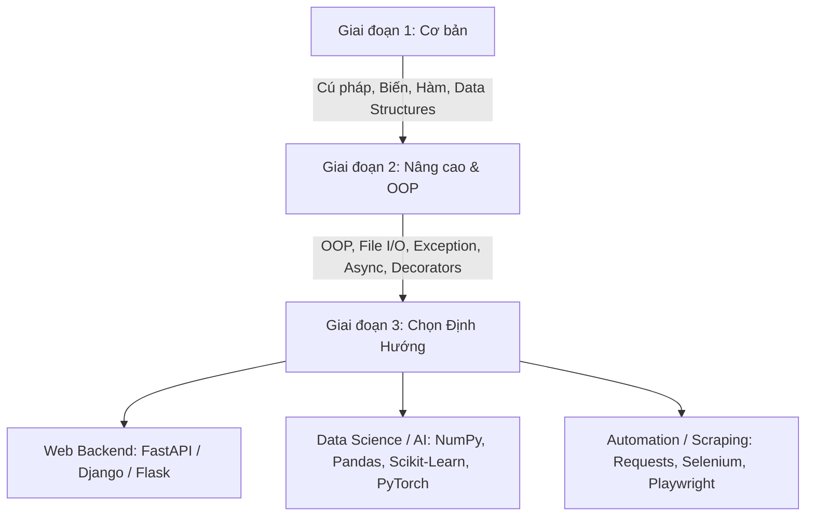

# 🐍 Tài Liệu Tự Học Python Toàn Diện (Từ Cơ Bản Đến Nâng Cao)

Tài liệu này được thiết kế theo lộ trình thực chiến, giải thích rõ ràng kèm ví dụ trực quan, bài tập và dự án mẫu giúp bạn làm chủ ngôn ngữ Python từ con số 0.

---

## 📑 Mục Lục
1. [Lộ Trình Học Python](#-1-lộ-trình-học-python)
2. [Cài Đặt Môi Trường Phát Triển](#-2-cài-đặt-môi-trường-phát-triển)
3. [Phần 1: Cú Pháp Cốt Lõi (Python Core Basics)](#-3-phần-1-cú-pháp-cốt-lõi-python-core-basics)
   - Biến & Kiểu dữ liệu
   - Toán tử & Ép kiểu
   - Cấu trúc điều kiện (`if-elif-else`)
   - Vòng lặp (`for`, `while`)
4. [Phần 2: Cấu Trúc Dữ Liệu Tích Hợp (Built-in Data Structures)](#-4-phần-2-cấu-trúc-dữ-liệu-tích-hợp)
   - `List`, `Tuple`, `Set`, `Dictionary`
   - List/Dict Comprehension
5. [Phần 3: Hàm & Phạm Vi Biến (Functions & Scope)](#-5-phần-3-hàm--phạm-vi-biến)
   - Định nghĩa hàm, `*args`, `**kwargs`
   - Lambda, Built-in functions (`map`, `filter`)
   - Type Annotations (Gợi ý kiểu dữ liệu)
6. [Phần 4: Lập Trình Hướng Đối Tượng (OOP)](#-6-phần-4-lập-trình-hướng-đối-tượng-oop)
   - Class, Object, Constructor `__init__`
   - 4 Tính chất: Đóng gói, Kế thừa, Đa hình, Trừu tượng
   - Magic Methods (`__str__`, `__repr__`, `__eq__`)
   - `@dataclass` & Property Decorator
7. [Phần 5: Xử Lý File & Ngoại Lệ (File I/O & Exception Handling)](#-7-phần-5-xử-lý-file--ngoại-lệ)
   - `try-except-finally` & Custom Exception
   - Đọc/ghi File Text, JSON, CSV
8. [Phần 6: Tính Năng Nâng Cao (Advanced Python)](#-8-phần-6-tính-năng-nâng-cao-advanced-python)
   - Decorators
   - Generators & `yield`
   - Bất đồng bộ (`asyncio`, `async/await`)
9. [Phần 7: Dự Án Mẫu Thực Hành (Hands-on Mini Projects)](#-9-phần-7-dự-án-mẫu-thực-hành)
   - Dự án 1: CLI Booking / Task Management (Console App)
   - Dự án 2: Xây dựng REST API Đặt Lịch với FastAPI & SQLite
10. [Tài Nguyên & Lời Khuyên Tiếp Theo](#-10-tài-nguyên--lời-khuyên-tiếp-theo)

---

## 🗺️ 1. Lộ Trình Học Python



---

## 🛠️ 2. Cài Đặt Môi Trường Phát Triển

### 2.1. Cài đặt Python & VS Code
1. **Tải Python:** Truy cập [python.org](https://www.python.org/downloads/) và tải bản mới nhất (3.11+ hoặc 3.12+).
   - ⚠️ *Lưu ý quan trọng:* Tích chọn **"Add python.exe to PATH"** khi cài đặt trên Windows.
2. **Cài đặt IDE:** Khuyên dùng **Visual Studio Code (VS Code)** hoặc **PyCharm**.
   - Trên VS Code, cài extension: `Python` (Microsoft), `Pylance`, `Black Formatter`.

### 2.2. Sử dụng Môi Trường Ảo (Virtual Environment)
Môi trường ảo giúp cô lập thư viện giữa các dự án:

```bash
# Tạo môi trường ảo tên là 'venv'
python -m venv venv

# Kích hoạt trên Windows (PowerShell):
.\venv\Scripts\Activate.ps1

# Kích hoạt trên macOS/Linux:
source venv/bin/activate

# Cài đặt thư viện và lưu vào requirements.txt:
pip install requests fastapi uvicorn
pip freeze > requirements.txt
```

---

## 🧱 3. Phần 1: Cú Pháp Cốt Lõi (Python Core Basics)

### 3.1. Biến và Kiểu Dữ Liệu Cơ Bản
Python tự động nhận diện kiểu dữ liệu (Dynamic Typing):

```python
# Kiểu số
age: int = 25                # Số nguyên
price: float = 19.99          # Số thực

# Kiểu chuỗi & Boolean
full_name: str = "Nguyễn Văn A"
is_active: bool = True

# Chuỗi định dạng F-String (Hiện đại & khuyến khích dùng)
greeting = f"Xin chào {full_name}, bạn {age} tuổi."
print(greeting)

# Ép kiểu dữ liệu (Type Casting)
str_num = "100"
converted_num = int(str_num)  # Chuyển chuỗi sang số nguyên
```

### 3.2. Cấu Trúc Điều Kiện (`if-elif-else`)

```python
score = 85

if score >= 90:
    grade = "Xuất sắc"
elif score >= 75:
    grade = "Giỏi"
elif score >= 50:
    grade = "Trung bình"
else:
    grade = "Yếu"

print(f"Kết quả xếp loại: {grade}")

# Toán tử 3 ngôi (Ternary Operator)
status = "Đậu" if score >= 50 else "Trượt"
```

### 3.3. Vòng Lặp (`for`, `while`)

```python
# 1. Vòng lặp for với range()
for i in range(1, 6): # Chạy từ 1 đến 5
    print(f"Lần lặp {i}")

# 2. Vòng lặp duyệt qua danh sách kèm chỉ số với enumerate
fruits = ["Táo", "Cam", "Xoài"]
for index, fruit in enumerate(fruits, start=1):
    print(f"{index}. {fruit}")

# 3. Vòng lặp while
count = 3
while count > 0:
    print(f"Đếm ngược: {count}")
    count -= 1
```

---

## 📦 4. Phần 2: Cấu Trúc Dữ Liệu Tích Hợp

Python có 4 kiểu cấu trúc dữ liệu dựng sẵn cực kỳ mạnh mẽ:

| Kiểu | Khả năng thay đổi (Mutable) | Thứ tự (Ordered) | Cho phép trùng lặp | Cú pháp |
| :--- | :--- | :--- | :--- | :--- |
| **List** | Có (Mutable) | Có | Có | `[1, 2, 3]` |
| **Tuple** | Không (Immutable) | Có | Có | `(1, 2, 3)` |
| **Set** | Có (Mutable) | Không | Không | `{1, 2, 3}` |
| **Dict** | Có (Mutable) | Có (từ Python 3.7+) | Khóa là duy nhất | `{"key": "value"}` |

### 4.1. Ví dụ Thực Tế

```python
# 1. List (Danh sách)
services = ["Cắt tóc", "Gội đầu", "Massage"]
services.append("Nhuộm tóc")
services.remove("Gội đầu")

# 2. Dictionary (Từ điển - Key-Value)
booking = {
    "customer": "Lê Văn B",
    "service": "Cắt tóc",
    "time": "14:00 2026-09-10",
    "price": 150000,
    "confirmed": True
}
print(booking["customer"])
print(booking.get("note", "Không có ghi chú"))  # An toàn, không báo lỗi nếu key không tồn tại

# 3. Set (Tập hợp - Tự loại bỏ phần tử trùng)
tags = {"python", "backend", "python", "developer"}
print(tags)  # {'python', 'backend', 'developer'}

# 4. List Comprehension (Tạo list nhanh, tinh gọn)
numbers = [1, 2, 3, 4, 5, 6, 7, 8, 9, 10]
even_squares = [x**2 for x in numbers if x % 2 == 0]
print(even_squares)  # [4, 16, 36, 64, 100]
```

---

## ⚙️ 5. Phần 3: Hàm & Phạm Vi Biến

### 5.1. Định Nghĩa Hàm & Tham Số Nâng Cao

```python
from typing import List, Optional

# Hàm có Type Hinting & Default value
def calculate_total(price: float, discount: float = 0.0, tax_rate: float = 0.1) -> float:
    """Tính tổng tiền thanh toán sau thuế và giảm giá."""
    discounted_price = price * (1 - discount)
    return round(discounted_price * (1 + tax_rate), 2)

total = calculate_total(price=200000, discount=0.1)
print(f"Tổng thanh toán: {total:,.0f} VND")

# *args (Số lượng tham số biến đổi) và **kwargs (Tham số dạng key-value)
def log_event(event_name: str, *tags: str, **metadata: any):
    print(f"Sự kiện: {event_name}")
    print(f"Tags: {', '.join(tags)}")
    print(f"Metadata: {metadata}")

log_event("UserLogin", "security", "auth", user_id=101, ip="192.168.1.1")
```

### 5.2. Lambda Function & Map / Filter

```python
# Lambda: hàm ẩn danh 1 dòng
multiply = lambda x, y: x * y
print(multiply(4, 5))  # 20

# Kết hợp với filter & map
prices = [100, 250, 400, 80]
expensive_prices = list(filter(lambda p: p >= 200, prices))  # [250, 400]
discounted = list(map(lambda p: p * 0.9, expensive_prices))    # [225.0, 360.0]
```

---

## 🏛️ 6. Phần 4: Lập Trình Hướng Đối Tượng (OOP)

### 6.1. Xây dựng Class & Các Nguyên Lý OOP

```python
from abc import ABC, abstractmethod
from datetime import datetime

# 1. Trừu tượng (Abstraction)
class BaseService(ABC):
    @abstractmethod
    def calculate_price(self) -> float:
        pass

# 2. Kế thừa & Đóng gói (Inheritance & Encapsulation)
class Booking(BaseService):
    def __init__(self, booking_id: str, customer_name: str, base_fee: float):
        self.booking_id = booking_id
        self.customer_name = customer_name
        self._base_fee = base_fee      # Protected attribute
        self.__is_cancelled = False    # Private attribute
        self.created_at = datetime.now()

    # Getter & Setter với @property
    @property
    def is_cancelled(self) -> bool:
        return self.__is_cancelled

    def cancel(self):
        self.__is_cancelled = True

    def calculate_price(self) -> float:
        return 0.0 if self.__is_cancelled else self._base_fee

    # Magic Method: Biểu diễn chuỗi khi in
    def __str__(self) -> str:
        status = "Đã hủy" if self.__is_cancelled else "Hợp lệ"
        return f"[Mã: {self.booking_id}] Khách: {self.customer_name} - Giá: {self.calculate_price()} ({status})"

# 3. Sử dụng Dataclass (Python 3.7+) cho model dữ liệu nhẹ nhàng
from dataclasses import dataclass

@dataclass
class Customer:
    id: int
    name: str
    phone: str
    email: str

# Khởi tạo và sử dụng
b = Booking(booking_id="BK-001", customer_name="Trần Thị Mai", base_fee=350000)
print(b)
b.cancel()
print(b)
```

---

## 🛡️ 7. Phần 5: Xử Lý File & Ngoại Lệ

### 7.1. Xử Lý Lỗi An Toàn (`try - except - finally`)

```python
class InvalidBookingError(Exception):
    """Ngoại lệ tùy chỉnh khi đặt lịch không hợp lệ."""
    pass

def validate_age(age: int):
    if age < 0 or age > 120:
        raise InvalidBookingError("Tuổi không hợp lệ!")

try:
    user_input = int("abc")  # Sẽ nảy sinh ValueError
except ValueError as e:
    print(f"Lỗi nhập dữ liệu: {e}")
except Exception as e:
    print(f"Lỗi không xác định: {e}")
finally:
    print("Khối finally luôn luôn chạy (dùng dọn dẹp tài nguyên).")
```

### 7.2. Đọc và Ghi File (JSON, CSV, Text)

```python
import json

data = {
    "salon": "Hair & Spa Studio",
    "bookings": [
        {"id": 1, "service": "Cắt tạo kiểu", "price": 120000},
        {"id": 2, "service": "Gội dưỡng sinh", "price": 80000}
    ]
}

# Ghi dữ liệu ra file JSON với context manager (tự động đóng file)
with open("data.json", "w", encoding="utf-8") as f:
    json.dump(data, f, ensure_ascii=False, indent=2)

# Đọc lại file JSON
with open("data.json", "r", encoding="utf-8") as f:
    loaded_data = json.load(f)
    print("Dữ liệu đã đọc:", loaded_data["salon"])
```

---

## 🚀 8. Phần 6: Tính Năng Nâng Cao (Advanced Python)

### 8.1. Decorator (Hàm bọc logic)

```python
import time
from functools import wraps

def timing_decorator(func):
    """Decorator đo thời gian thực thi hàm."""
    @wraps(func)
    def wrapper(*args, **kwargs):
        start_time = time.time()
        result = func(*args, **kwargs)
        duration = time.time() - start_time
        print(f"⏱️ Hàm '{func.__name__}' thực thi trong {duration:.4f} giây.")
        return result
    return wrapper

@timing_decorator
def heavy_processing():
    total = sum(i * i for i in range(1_000_000))
    return total

heavy_processing()
```

### 8.2. Generator & `yield` (Tiết kiệm bộ nhớ)

```python
def fibonacci(limit: int):
    """Sinh dãy Fibonacci từng phần tử một thay vì tạo cả list."""
    a, b = 0, 1
    for _ in range(limit):
        yield a
        a, b = b, a + b

for num in fibonacci(8):
    print(num, end=" ") # 0 1 1 2 3 5 8 13
print()
```

### 8.3. Lập Trình Bất Đồng Bộ (`asyncio`)

```python
import asyncio

async def fetch_service_data(service_id: int):
    print(f"Bắt đầu lấy dữ liệu dịch vụ {service_id}...")
    await asyncio.sleep(1)  # Giả lập gọi API hoặc truy vấn DB
    print(f"Đã lấy xong dịch vụ {service_id}")
    return {"id": service_id, "name": f"Dịch vụ {service_id}"}

async def main():
    # Chạy đồng thời nhiều tác vụ I/O
    results = await asyncio.gather(
        fetch_service_data(1),
        fetch_service_data(2),
        fetch_service_data(3)
    )
    print("Kết quả:", results)

# asyncio.run(main()) # Chạy event loop
```

---

## 🛠️ 9. Phần 7: Dự Án Mẫu Thực Hành

### 🎯 Dự Án 1: Ứng Dụng CLI Quản Lý Lịch Hẹn (`booking_cli.py`)

Hãy tạo một file `booking_cli.py` và chạy thử:

```python
import json
import os
from datetime import datetime

DATA_FILE = "bookings.json"

def load_bookings():
    if not os.path.exists(DATA_FILE):
        return []
    with open(DATA_FILE, "r", encoding="utf-8") as f:
        return json.load(f)

def save_bookings(bookings):
    with open(DATA_FILE, "w", encoding="utf-8") as f:
        json.dump(bookings, f, ensure_ascii=False, indent=2)

def add_booking():
    customer = input("Nhập tên khách hàng: ").strip()
    service = input("Nhập tên dịch vụ: ").strip()
    time_str = input("Nhập thời gian (YYYY-MM-DD HH:MM): ").strip()
    
    bookings = load_bookings()
    new_id = len(bookings) + 1
    new_booking = {
        "id": new_id,
        "customer": customer,
        "service": service,
        "time": time_str,
        "status": "CONFIRMED"
    }
    bookings.append(new_booking)
    save_bookings(bookings)
    print(f"✅ Đã thêm lịch hẹn thành công! Mã: {new_id}\n")

def list_bookings():
    bookings = load_bookings()
    if not bookings:
        print("📭 Hiện chưa có lịch hẹn nào.\n")
        return
    print("\n--- 📋 DANH SÁCH LỊCH HẸN ---")
    for b in bookings:
        print(f"[{b['id']}] Khách: {b['customer']:<18} | Dịch vụ: {b['service']:<15} | Giờ: {b['time']} | TT: {b['status']}")
    print("------------------------------\n")

def main():
    while True:
        print("=== QUẢN LÝ ĐẶT LỊCH (BOOKING MANAGEMENT) ===")
        print("1. Xem danh sách lịch hẹn")
        print("2. Thêm lịch hẹn mới")
        print("3. Thoát")
        choice = input("Lựa chọn của bạn (1-3): ").strip()

        if choice == "1":
            list_bookings()
        elif choice == "2":
            add_booking()
        elif choice == "3":
            print("Tạm biệt!")
            break
        else:
            print("❌ Lựa chọn không hợp lệ, vui lòng thử lại.\n")

if __name__ == "__main__":
    main()
```

---

## 🌟 10. Tài Nguyên & Lời Khuyên Tiếp Theo

### Nguyên Tắc Viết Code Python Chuẩn (Pythonic)
1. Tuân thủ **PEP 8** (Coding style guide của Python): đặt tên biến `snake_case`, tên class `PascalCase`.
2. Luôn sử dụng `Type Annotations` để code rõ ràng, dễ bảo trì.
3. Sử dụng `with open(...)` thay vì tự đóng mở file thủ công.

### Các Bước Thực Hành Đề Xuất
- [ ] Chạy và thử nghiệm từng đoạn code trong tài liệu này.
- [ ] Tự mở rộng dự án `booking_cli.py` với tính năng: Hủy lịch hẹn, Sửa lịch hẹn, Tìm kiếm theo tên khách.
- [ ] Chuyển sang tìm hiểu thư viện Web **FastAPI** hoặc **Django** để tạo Backend Web App hoàn chỉnh.
